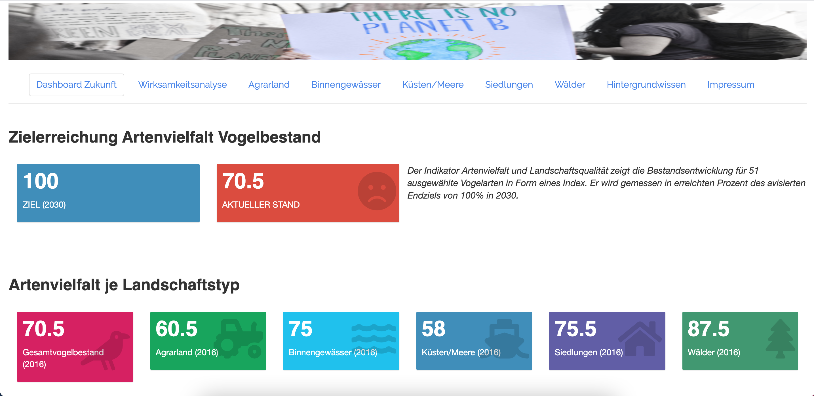
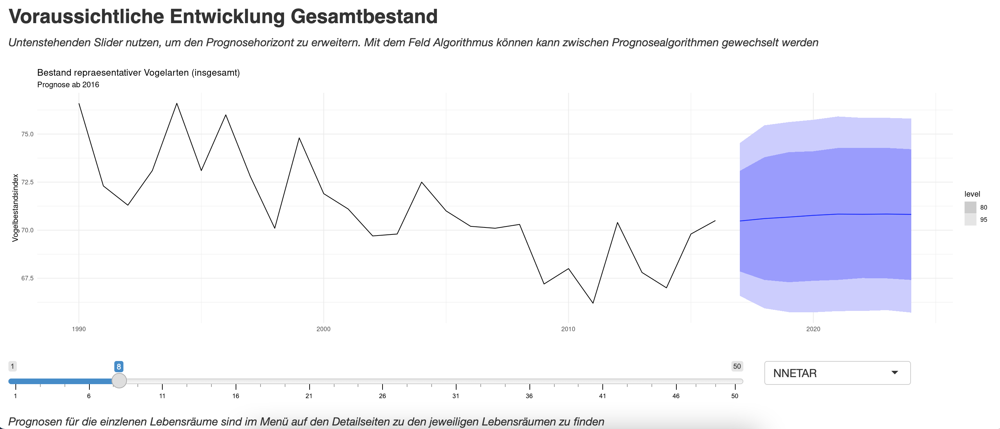
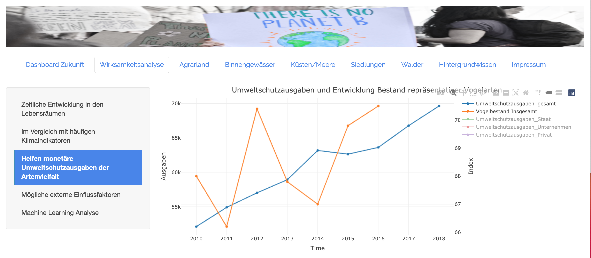

# Dashboard Zukunft 

A web application about protection of nature and climate for the Destatis AI hackathon.
(see German Federal Statistical Office www.destatis.de)

By Team C for Climate (Denis, Laura, Maria, Steffen)

# About the project

### Website

Our dashboard can be found under: https://stmo.shinyapps.io/dashboard-zukunft/
(or www.dashboard-zukunft.de )

### Screenshots
Here are some screenshots of the web application:

The starting pages gives an overview about the current state of the biodiversity indicator, that details
biodiversity for bird species in Germany.

  
 

 
 Also on the starting page, there is a forecast included, what biodiversity could look like in some years.
 

  
 

 
We are also trying to show, what factors influence biodiversity and if government spending on climate measures has had a positive impact on biodiversity.
 

  
 

# Implementation

### Technical details

- Dashboard is made with R 'shiny'
- Additionally uses 'shinythemes' and 'shinydashboard' packages
- Interactive plots are made with the 'plotly' package
- Currently hosted via shinyapps.io
- Time series forecasts are made with the 'fable' package

### Packages
Here is a complete list of used packages:

- shiny
- shinythemes
- plotly
- shinydashboard
- fable
- imputeTS
- tidyverse
- stats
- rsconnect

### Data
The biodiversity data is sourced from the Umweltbundesamt.

